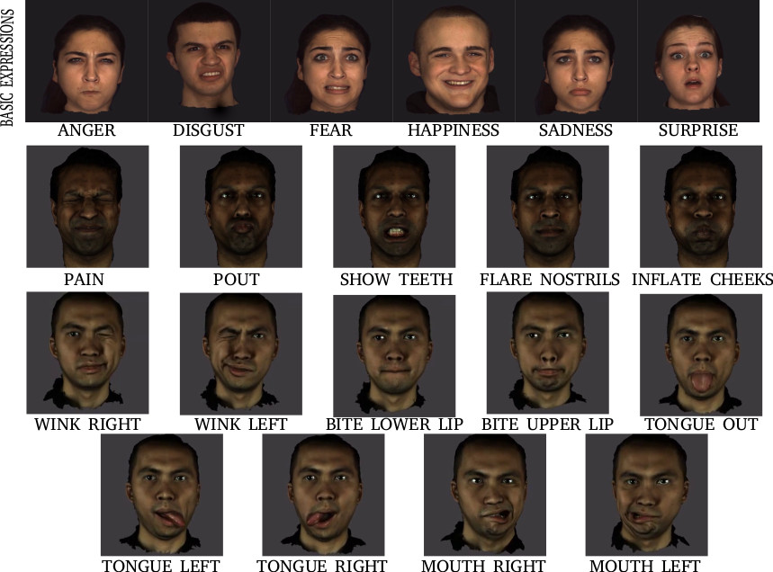

# MimicME
Athanasios Papaioannou<sup>* </sup>, Baris Gecer<sup>* </sup>, Shiyang Cheng<sup>* </sup>, Grigorios G. Chrysos<sup>* </sup>, Jiankang Deng<sup>* </sup>, Eftychia Fotiadou<sup>* </sup>, Christos Kampouris<sup>* </sup>, Dimitrios Kollias<sup>* </sup>, Stylianos Moschoglou<sup>* </sup>, Kritaphat Songsri-In<sup>* </sup>, Stylianos Ploumpis<sup>* </sup>, George Trigeorgis<sup>* </sup>, Panagiotis Tzirakis<sup>* </sup>, Evangelos Ververas<sup>* </sup>, Yuxiang Zhou<sup>* </sup>, Allan Ponniah, Anastasios Roussos<sup>2, 3 </sup>, [Stefanos Zafeiriou](https://wp.doc.ic.ac.uk/szafeiri/)<sup> 1</sup>
<br/>
<sup>1 </sup>Imperial College London, UK <br/>
<sup>2 </sup> University of Exeter, UK <br/>
<sup> 3 </sup> Institute of Computer Science, Foundation for Research and Technology Hellas
<sup> * </sup> <br/>
Authors were with Imperial College London during this work.
 <br/>
## Abstract

Recently, Deep Neural Networks (DNNs) have been shown to outperform traditional methods  in many disciplines  such as computer vision, speech recognition and  natural language processing. A prerequisite for the successful application of DNNs is the big number of data. Even though various facial datasets exist for the case of 2D images, there is a remarkable absence of datasets when we have to deal with 3D faces. The available facial datasets are limited either in terms of expressions or in the number of subjects. This lack of large datasets hinders  the exploitation of the great advances that  DNNs can provide. In this work, we overcome these limitations by introducing MimicMe, a novel large-scale database of dynamic high-resolution 3D faces. MimicMe contains recordings of $4,700$ subjects with a great diversity on age, gender and  ethnicity. The recordings are in the form of 4D videos of subjects displaying a multitude of facial behaviours, resulting to over $280,000$  3D meshes in total. We have also manually annotated a big portion of these meshes with 3D facial landmarks and they have been categorized in the corresponding expressions.  We have also built very powerful blendshapes for parameterising facial behaviour.
MimicMe will be made publicly available and we envision that it will be extremely valuable to researchers working in many problems of face modelling and analysis, including 3D/4D face and facial expression recognition. We conduct several experiments and demonstrate the usefulness of the database for various applications.

<p align="center"></p>

## Public release of MimicMe dataset
The MiMicME database can  be obtained and used by researchers who wish to perform non-comercial research. The database includes the meshes of approximately  $4,700$ subjects performing various expressions and registered to a common template, metadata about their age, gender and ethnicity, and textures for the registered meshes. 

The MiMicME has been freely available for research and education purposes. To obtain access to the dataset, you need to complete and sign the user agreement form (TBA in this repository). This agreement should be completed by a full-time academic staff member (not a student). The form should be signed, and emailed to Athanasios Papaioannou (apapaion@gmail.com) and Stefanos Zafeiriou (s.zafeiriou@imperial.ac.uk). We will verify your request and contact you on how to download the dataset. Note that the agreement requires that:

1. The dataset must be used for non-commercial research and education purposes only.
2. You agree not copy, sell, trade, or exploit the dataset for any commercial purposes.
3. In any published research using the models, you cite the following paper:

## Citation
If you find this work is useful for your research, please cite our paper
```
@inproceedings{thanos2022,
  title={MimicME: A Large Scale Diverse 4D Database for Facial Expression Analysis},
  author={Papaioannou, Athanasios an Baris, Gecer and Cheng, Shiyang and   Chrysos, Grigorios G. and Deng, Jiankang and Fotiadou, Eftychia and  Kampouris, Christos and Kollias, Dimitrios and  Moschoglou, Stylianos and  Songsri-In, Kritaphat and Ploumpis, Stylianos and Trigeorgis, George and Tzirakis, Panagiotis and Ververas, Evangelos and Zhou, Yuxiang and  Ponniah, Allan and Roussos, Anastasios and Zafeiriou, Stefanos}  
booktitle={Proceedings of the European Conference on Computer Vision},
  year={2022}
}
```
